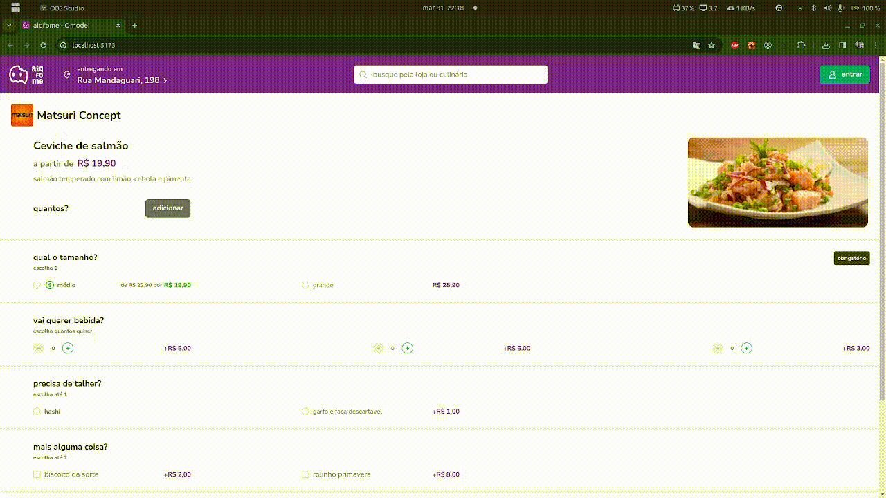

# aiqfome

Este projeto é uma interface desenvolvida com React, TypeScript, Styled-Components e Chakra UI.



## Tecnologias Utilizadas

- **React:** Uma biblioteca JavaScript para construir interfaces de usuário.
- **TypeScript:** Um superset tipado de JavaScript que adiciona tipagem estática à linguagem.
- **Styled-Components:** Uma biblioteca para estilizar componentes usando tagged template literals.
- **Chakra UI:** Uma biblioteca de componentes React acessíveis e estilizados.

## Gerenciamento de Dependências

Para gerenciar as dependências, utilizamos o **PNPM**, um gerenciador de pacotes rápido, eficiente e que compartilha dependências entre diferentes projetos.

## Instruções de Uso

1. **Instalação das Dependências:**
  ```sh
   pnpm install
  ```

2. **Execução do Projeto:**
  ```sh
   pnpm dev
  ```

3. **Acesso à Interface:**
Acesse o aplicativo através do navegador no endereço fornecido após a execução do projeto.
